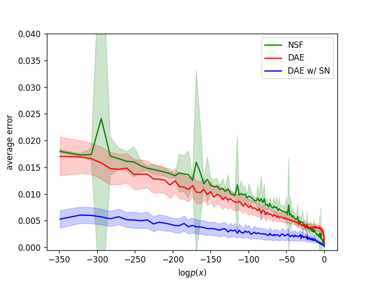
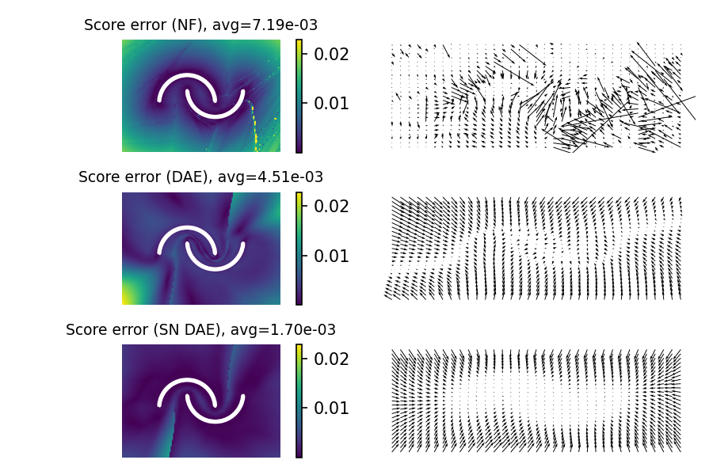
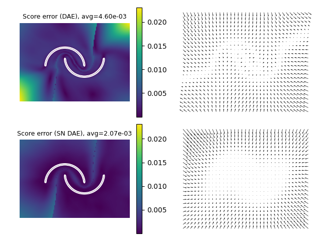
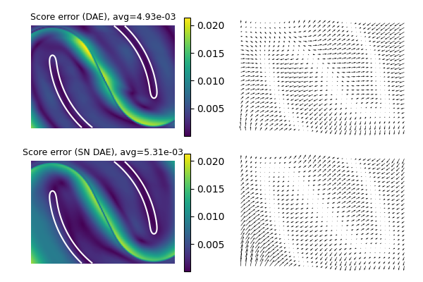
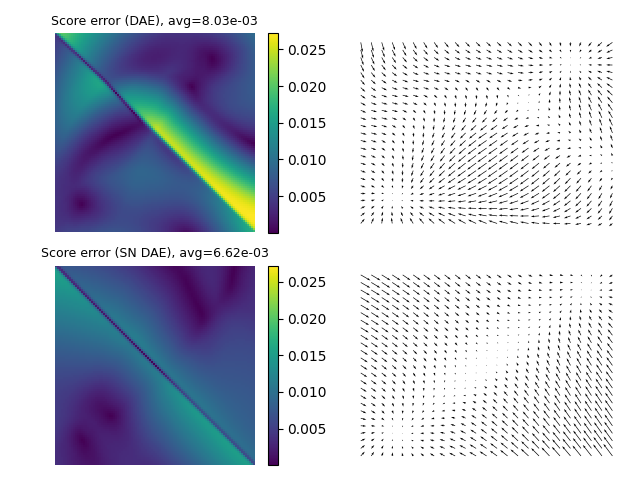
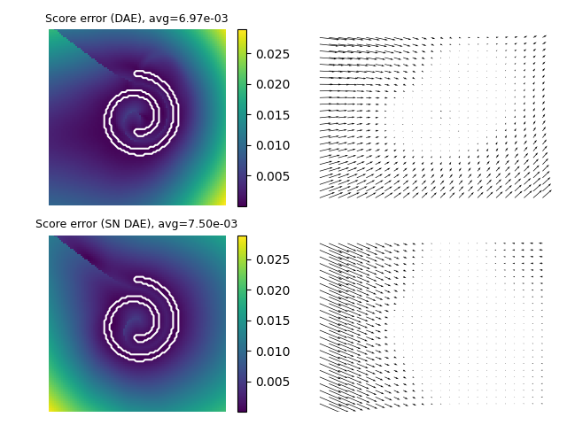

# Neural Score Estimation Comparison for Generative Modeling

How models generalize? (The higher the log likelihood, the closer to the data distribution)

Methods comparison at commit 3b6a122c81bdddf08871e90fd6c6ad6d0973f03e.

See notebook in branch *normalizing_flows*

First results at commit 13dc9331c78c7091ee6faf5e18f6e8cbc1c6b21f
(for one draw)

**Tow moons dataset (L=2)**

*At large scale*

*At close scale*

**Two gaussians dataset (L=2)**

**Swiss roll dataset (L=2)**

