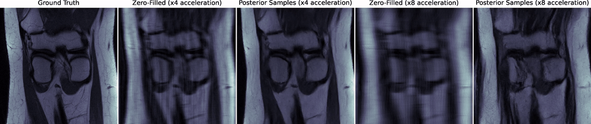
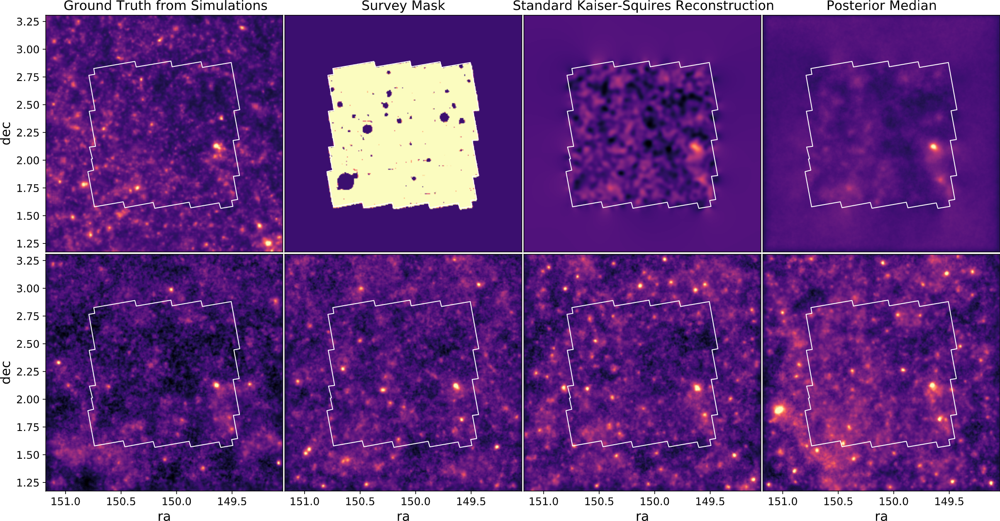

Code repository for the two following papers:

- [Denoising Score-Matching for Uncertainty Quantification in Inverse Problems](https://arxiv.org/abs/2011.08698),
Zaccharie Ramzi, Benjamin Remy, François Lanusse, Jean-Luc Starck and Philippe Ciuciu
*Deep Learning and Inverse Problems Workshop, NeurIPS 2020.*

- [Probabilistic Mapping of Dark Matter by Neural Score Matching](https://arxiv.org/abs/2011.08271),
Benjamin Remy, François Lanusse, Zaccharie Ramzi, Jia Liu, Niall Jeffrey and Jean-Luc Starck.
*Machine Learning and the Physical Sciences Workshop, NeurIPS 2020.*

